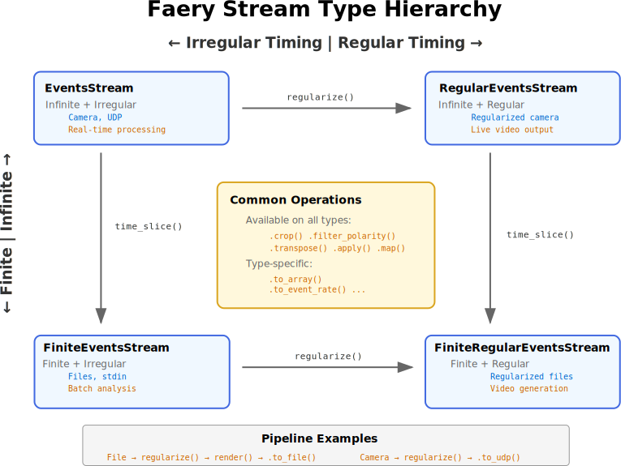

# Core concepts

Understanding Faery's fundamental concepts is essential for effectively processing neuromorphic event data. This section introduces the key abstractions that power Faery's stream processing architecture.

## Event data format

Neuromorphic sensors generate **events** - discrete signals triggered by changes in the environment. Each event represents a pixel that detected a change at a specific time.

### Event structure

Every event in Faery contains four pieces of information:

```python
Event = (timestamp, x_coordinate, y_coordinate, polarity)
```

- **Timestamp (t)**: When the event occurred (64-bit microseconds)
- **X coordinate (x)**: Horizontal pixel position (16-bit integer)
- **Y coordinate (y)**: Vertical pixel position (16-bit integer)
- **Polarity (p)**: Direction of change (boolean: True=increase, False=decrease in brightness)

### Example events

```python
import numpy as np
import faery

# Create events manually
events = np.array([
    (1000, 320, 240, True),   # Brightness increased at center pixel at t=1ms
    (1500, 321, 240, False),  # Brightness decreased at adjacent pixel at t=1.5ms
    (2000, 319, 241, True),   # Another increase nearby at t=2ms
], dtype=faery.EVENTS_DTYPE)
```

This sparse representation is highly efficient - only changing pixels generate events, unlike traditional cameras that capture every pixel at fixed intervals.

## Stream processing architecture

Faery processes events through **streams** - sequences of event packets that flow through processing pipelines. Understanding stream types is crucial for building effective data processing workflows.

| Stream Type | Finite? | Regular? | Can `.to_array()`? | Can `.to_file()` video? |
|-------------|---------|----------|--------------------|-------------------------|
| `EventsStream` | ❌ | ❌ | ❌ | ❌ |
| `FiniteEventsStream` | ✅ | ❌ | ✅ | After `.regularize()` |
| `RegularEventsStream` | ❌ | ✅ | ❌ | ❌ |
| `FiniteRegularEventsStream` | ✅ | ✅ | ✅ | ✅ |

Understanding these stream types and their sources enables you to choose the right input and build effective processing pipelines for your specific use case.

### Stream hierarchy



Streams are organized into a hierarchy based on two key characteristics:

1. **Finiteness**: Whether the stream has a definite end
2. **Regularity**: Whether packets arrive at fixed time intervals

## Stream types explained

### Base stream types

**EventsStream** (Infinite, Irregular)
- Continues indefinitely
- Packet timing varies
- **Example**: Live camera feed, UDP stream
- **Use case**: Real-time processing, monitoring

**FiniteEventsStream** (Finite, Irregular)
- Has a definite end
- Packet timing varies
- **Example**: File input, recorded data
- **Use case**: Batch processing, analysis

### Regular stream types

**RegularEventsStream** (Infinite, Regular)
- Continues indefinitely
- Fixed packet intervals
- **Example**: Regularized camera feed
- **Use case**: Real-time video generation

**FiniteRegularEventsStream** (Finite, Regular)
- Has definite end
- Fixed packet intervals
- **Example**: Regularized file data
- **Use case**: Video generation from recordings

## Implementation details

All streams in Faery are implemented as a [`Stream`](https://github.com/aestream/faery/blob/main/python/faery/stream.py#L9) class which iterates over data packets. The data type characterizes what is contained in each packet:

### Data types

| Stream | Data Type | Characteristics |
|--------|-----------|-----------------|
| **EventsStream** | `np.ndarray` | Sparse event data represented as [timestamps, 2-d coordinates, and polarity bit](https://github.com/aestream/faery/blob/main/python/faery/events_stream.py#L16) `(t, x, y, p)`. |
| **FrameStream** | [`Frame`](https://github.com/aestream/faery/blob/main/python/faery/frame_stream.py#L19) | Dense frame data represented as `[timestamp, np.ndarray]`](https://github.com/aestream/faery/blob/main/python/faery/frame_stream.py#L165). |

### Stream characteristics

Apart from the data type, streams have characteristics that determine what operations are possible:

| Stream Type | Description | Examples |
|-------------|-------------|----------|
| **InfiniteStream** | Requires continuous processing, no definite end | Reading from camera or UDP source |
| **FiniteStream** | Can be processed in a single pass, has definite end | Reading from file or finite source |
| **RegularStream** | Sends data at regular intervals | Filtering stream to output at fixed intervals |
| **FiniteRegularStream** | Both finite and regular | Filtering finite stream at regular intervals |

## Stream type transformations

Understanding how operations transform stream types is key to building valid processing pipelines:

```python
import faery

# File input creates FiniteEventsStream
stream = faery.events_stream_from_file("events.aedat4")  # FiniteEventsStream

# Regularization creates FiniteRegularEventsStream
regular_stream = stream.regularize(frequency_hz=30.0)    # FiniteRegularEventsStream

# Rendering creates a FrameStream
rendered_stream = regular_stream.render(decay="exponential", tau="00:00:00.200000", colormap=faery.colormaps.starry_night)  # FiniteRegularFrameStream

# Video output requires a finite frame stream
rendered_stream.to_file("output.mp4")  # ✓ Valid - finite stream can be saved to file
```

### Making Infinite Streams Finite

Some operations require finite streams. Use slicing operations to convert:

```python
# This would fail - infinite streams cannot be saved as complete video files
camera_stream = faery.events_stream_from_camera()  # EventsStream (infinite)
camera_stream.regularize(30.0).render(...).to_file("video.mp4")  # ❌ Error - no known end

# Solution: Use time_slice to make it finite
camera_stream.time_slice(0 * faery.s, 10 * faery.s)  # ✓ First 10 seconds
    .regularize(frequency_hz=30.0) \
    .render(decay="exponential", tau="00:00:00.100000", colormap=faery.colormaps.devon) \
    .to_file("10_second_video.mp4")  # ✓ Valid - finite duration

# Or use event_slice for a specific number of events
camera_stream.event_slice(0, 100000)  # ✓ First 100,000 events
    .to_array()  # ✓ Valid - finite number of events
```

## Processing Pipeline Patterns

### Pattern 1: File Processing
```python
# Finite → Finite Regular → Output
faery.events_stream_from_file("input.aedat4") \
    .regularize(frequency_hz=60.0) \
    .render(decay="exponential", tau="00:00:00.200000", colormap=faery.colormaps.starry_night) \
    .to_file("output.mp4")
```

### Pattern 2: Real-time Processing
```python
# Infinite → Finite → Regular → Output
faery.events_stream_from_camera() \
    .time_slice(0 * faery.us, 5 * faery.s) \
    .regularize(frequency_hz=30.0) \
    .render(decay="exponential", tau="00:00:00.100000", colormap=faery.colormaps.devon) \
    .to_file("live.mp4")  # Creates 5-second video file
```

### Pattern 3: Analysis Pipeline
```python
# Finite → Analysis
faery.events_stream_from_file("data.es") \
    .remove_off_events() \
    .to_event_rate(window_duration_us=100000) \
    .to_file("event_rates.csv")
```

## Stream Type Transformations

Understanding how operations change stream types:

### Making Infinite Streams Finite
```python
# ❌ This fails - infinite stream can't create complete video
faery.events_stream_from_camera().regularize(30.0).render(...).to_file("video.mp4")

# ✅ This works - slice first to make finite
faery.events_stream_from_camera().time_slice(0 * faery.s, 5 * faery.s) \
    .regularize(30.0).render(...).to_file("video.mp4")
```

### Making Irregular Streams Regular
```python
# File (Finite + Irregular) → regularize() → (Finite + Regular)
faery.events_stream_from_file("data.es").regularize(frequency_hz=60.0)

# Camera (Infinite + Irregular) → regularize() → (Infinite + Regular)
faery.events_stream_from_camera().regularize(frequency_hz=30.0)
```

## Stream State and Memory

Faery streams are designed for memory efficiency:

### Streaming Processing
```python
# Events are processed in small packets - memory usage stays constant
large_file_stream = faery.events_stream_from_file("10GB_events.aedat4")
processed = large_file_stream.regularize(frequency_hz=30.0)  # Still memory-efficient
```

### Finite Collection
```python
# Only when explicitly collecting all data does memory usage grow
all_events = large_file_stream.to_array()  # Loads entire file into memory
```

## Common Patterns by Stream Type

### Finite Streams (Files, Arrays, stdin)
```python
# Pattern: Input → Filter → Regular → Output
source.filter_operation() \
      .regularize(frequency_hz) \
      .render(...) \
      .to_file("output.mp4")  # ✅ Always works
```

### Infinite Streams (Cameras, UDP)
```python
# Pattern: Input → Slice → Regular → Output
source.time_slice(start, end) \
      .regularize(frequency_hz) \
      .render(...) \
      .to_file("output.mp4")  # ✅ Works after slicing

# Pattern: Input → Process → Stream
source.filter_operation() \
      .to_udp(address)  # ✅ Stream-to-stream always works
```

## Practical Guidelines

### Choose the Right Input
- **Files**: Use for analysis, batch processing, reproducible results
- **Cameras**: Use for real-time applications, live monitoring
- **UDP**: Use for distributed processing, network integration
- **Arrays**: Use for testing, simulation, synthetic data

### Design Processing Pipelines
1. **Start with your input type** - determines initial stream type
2. **Apply filtering early** - reduce data volume for efficiency
3. **Regularize when needed** - required for video output and real-time processing
4. **Choose appropriate output** - match output requirements to stream type

### Debug Stream Issues
```python
# Check stream type and properties
stream = faery.events_stream_from_file("data.es")
print(f"Dimensions: {stream.dimensions()}")
print(f"Stream type: {type(stream)}")

# Preview first few packets
for i, packet in enumerate(stream):
    print(f"Packet {i}: {len(packet)} events")
    if i >= 2:  # Just show first 3 packets
        break
```

Understanding these concepts enables you to build efficient, type-safe processing pipelines that leverage Faery's full capabilities while avoiding common pitfalls.
